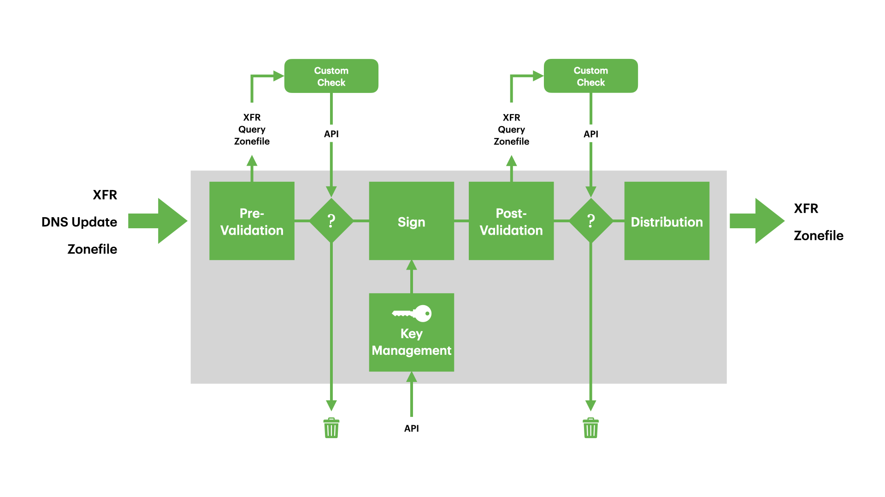

Architecture
============

The Pipeline
------------

Zone changes are said to cascade through a pipeline consisting of several
stages:

.. code-block::

   - Loading
     - Approving
       - Signing
         - Approving
           - Publishing

Robustness
----------

Cascade is written in the Rust programming language making it significantly
less likely to crash or suffer from memory safety issues, and at the same time
making it easier to leverage the higher core count of modern computers via
Rust's "fearless concurrency" when needed.

Cascade outsources PKCS#11 module loading to a separate :program:`kmip2pkcs11`
daemon to avoid running untrusted 3rd party code inside the main Cascade
process also thereby eliminating another source of potential instability and
unpredictable behaviour and resource usage.

Flexible Signing
----------------

Cascade does not *require* an HSM to operate. While it is common practice
to secure cryptographic key material using an HSM, not all operators use an
HSM. Cascade is able to use `OpenSSL <https://www.openssl.org>`_ and/or `ring
<https://crates.io/crates/ring/>`_ software cryptography to generate signing
keys and to cryptographically sign DNS RRSET data, storing the generated keys
in on-disk files.

For operators wishing to use a HSM Cascade can connect directly to KMIP
compatible HSMs, or to PKCS#11 compatible HSMs via our :program:`kmip2pkcs11`
daemon which is installed automatically as part of our Cascade packages.

Bespoke Zone Verification
-------------------------

Cascade supports optional verification of your zone data at two critical
stages: verification of the unsigned zone, and verification of the signed
zone.

In both cases verification consists of executing an operator supplied script
or application which can verify the zone using whatever mechanisms are
required to satisfy your policy.

Verification of the zone can be done by retrieving the zone using the DNS XFR
protocol from dedicated "review" nameservers within Cascade, either verifying
the zone directly or writing the zone to disk for verification by tools that
only support working with files.

On completion of the verification process, approval or rejection is signalled
back to Cascade via the script exit code.

Rejecting a zone "soft" halts the Cascade pipeline for the zone, preventing it
from cascading further down the pipeline, but allowing a newer version of the
zone to be completely processed (unless that too should fail verification).

Serious errors in the pipeline may result in a "hard" halt for the pipeline
of a zone preventing any further processing of that zone for the current and
future versions of the zone until an operator manually resumes the pipeline.

Daemon Processes
----------------

Unlike OpenDNSSEC, Cascade does not run as two separate daemons (the Enforcer
and the Signer) but instead is able to act entirely on its own, as long as
on-disk signing keys are permitted by your organizational security policy or
when using a KMIP compatible HSM.

If required a KMIP or PKCS#11 compatible HSM can be used instead of on-disk
keys. In the case of a KMIP compatible HSM there will still be only a single
Cascade daemon. If using a PKCS#11 compatible HSM you will also need to run
the :program:`kmip2pksc11` daemon which will receive KMIP TCP TLS requests
from Cascade and convert them into operations to execute against a loaded
PKCS#11 module.

In this latter setup it may appear similar to the architecture of OpenDNSSEC
in that it has two processes, one daemon acting as a nameserver and issuing
signing instructions to the other daemon.

However, the resemblance is only slight, as there are no shared on-disk
configuration files via which the daemons communicate, and thus no shared
on-disk state which can become out of sync between daemons or vs the in-memory
view of the world possessed by each daemon.

This is because with Cascade the second daemon, :program:`kmip2pkcs11`, is
much simpler than the OpenDNSEC signer daemon, it only receives and executes
signing requests on a per DNS RRSET basis, it is not responsible for the
entire zone and exists to shield the main Cascade daemon from the risks posed
by PKCS#11.

OpenDNSSEC is not able to communicate directly from the Enforcer to a remotely
running Signer, it is only able to write files to disk and then expects the
operator to correctly make the appropriate files available to the signer in
the expected location such that they form a logically consistent set. With
Cascade the communication between daemon processes uses the KMIP TCP TLS
protocol whether daemons are local or running on separate servers, using a
direct encrypted connection to communicate.

Managing State
--------------

Cascade stores its state in on-disk files in JSON format, by default at
various locations under a single parent directory. No additional database
software is required, state is human readable and easily backed up.

Some configuration is done via the Cascade CLI (adding zones and HSMs), other
configuration is done by editing on-disk policy and application configuration
files and instructing the Cascade daemon via the CLI to reload them.

The Cascade daemon updates its on-disk state files periodically, and when
signalled to stop, reloading them on next start.

As Cascade outsources PKCS#11 support to :program:`kmip2pkcs11` it does not
require access to PKCS#11 related configuration files or other PKCS#11 module
dependencies.

