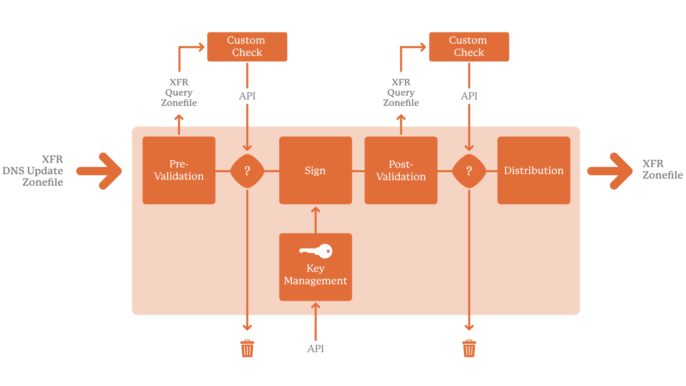

Architecture
============

The Pipeline
------------

Zone changes are said to cascade through a pipeline consisting of several
stages, letting you review and approve at each step:

   A schematic view of of the Cascade pipeline with the verification stages.

Flexible Signing
----------------

Cascade does not require a :term:`Hardware security module (HSM)` to
operate. While it is common practice to secure cryptographic key material
using an HSM, not all operators use an HSM. Cascade is able to use `OpenSSL
<https://www.openssl.org>`_ and/or `ring <https://crates.io/crates/ring/>`_
software cryptography to generate signing keys and to cryptographically sign
DNS :term:`RRset <Resource Record Set (RRset)>` data, storing the generated
keys in on-disk files.

For operators wishing to use an HSM, Cascade can connect directly to KMIP
compatible HSMs, or to PKCS#11 compatible HSMs via our :program:`kmip2pkcs11`
daemon, which is installed automatically as part of our Cascade packages.

.. note:: Separating the main Cascade and HSM-relay daemons avoids running 
   untrusted third-party code inside the main Cascade process. This 
   eliminates a source of potential instability and unpredictable behaviour,
   as well as limiting resource usage.

Bespoke Zone Verification
-------------------------

Using :doc:`review-hooks`, Cascade supports optional verification of your
zone data at two critical stages: verification of the unsigned zone, and
verification of the signed zone. In both cases verification consists of
executing an operator supplied script or application which can verify the
zone using whatever mechanisms are required to satisfy your policy.

Verification of the zone can be done by retrieving it using the :term:`zone
transfer <Zone transfer>` protocol from dedicated "review" nameservers within
Cascade, either verifying the zone directly or writing the zone to disk for
verification by tools that only support working with files.

On completion of the verification process, approval or rejection is signalled
back to Cascade via the script exit code.

Rejecting a zone "soft" halts the Cascade pipeline for the zone, preventing it
from cascading further down the pipeline, but allowing a newer version of the
zone to be completely processed (unless that too should fail verification).

Serious errors in the pipeline may result in a "hard" halt for the pipeline
of a zone, preventing any further processing of that zone for the current and
future versions until an operator manually resumes the pipeline.

Managing State
--------------

Cascade stores its state in on-disk files in JSON format, by default at
various locations under a single parent directory. No additional database
software is required. As such, state is human-readable and easily backed up.
Note however, that state files are not intended to be modified by the user.

Some configuration is done via the Cascade CLI (adding zones and HSMs), other
configuration is done by editing on-disk policy and application configuration
files and instructing the Cascade daemon via the CLI to reload them.

The Cascade daemon updates its on-disk state files periodically, and when
signalled to stop, reloading them on next start.

As Cascade outsources PKCS#11 support to :program:`kmip2pkcs11`, it does not
require access to PKCS#11 related configuration files or other PKCS#11 module
dependencies.

Robustness
----------

Cascade is written in the Rust programming language making it significantly
less likely to crash or suffer from memory safety issues, and at the same
time making it easier to leverage the higher core count of modern computers
via Rust's "`fearless concurrency
<https://doc.rust-lang.org/book/ch16-00-concurrency.html>`_" when needed.