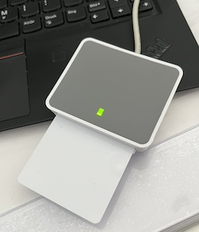

Integrating with a SmartCard-HSM
================================

.. Note:: The instructions on this page are for an Debian 12 host and assume
   that Cascade has already been installed using our DEB package.

.. Note:: The instructions on this page assume you will be using the Smart Card
   exclusively for the task at hand and might wipe the content of the SC.

.. epigraph::

   SmartCard-HSM is a lightweight Hardware Security Module in a Smart Card,
   MicroSD or USB form factors and protect your RSA and ECC keys in hardware.
   They are accessible through a PKCS #11 interface. You can use them to
   experiment with PKCS #11 without having to purchase an expensive HSM.

   -- https://www.smartcard-hsm.com

Install the prerequisites
~~~~~~~~~~~~~~~~~~~~~~~~~

.. code-block:: bash

   # apt install -y opensc opensc-pkcs11

Identify the card reader 
~~~~~~~~~~~~~~~~~~~~~~~~

Your card reader may well be of a different vendor and type.

.. code-block:: bash

   # opensc-tool -l
   # Detected readers (pcsc)
   Nr.  Card  Features  Name
   0    Yes             Identive CLOUD 2700 R Smart Card Reader [CCID Interface]

Initialize the smartcard 
~~~~~~~~~~~~~~~~~~~~~~~~

The card is configured with the SO PIN and user PIN as per the vendor. You can
later change these.

.. code-block:: bash

   # sc-hsm-tool --initialize --so-pin 0123012301230123 --pin 123456
   Using reader with a card: Identive CLOUD 2700 R Smart Card Reader [CCID Interface]

List the Smart Card's mechanisms
~~~~~~~~~~~~~~~~~~~~~~~~~~~~~~~~

.. code-block:: bash

   # pkcs11-tool --module opensc-pkcs11.so --list-mechanisms
   Using slot 0 with a present token (0x0)
   Supported mechanisms:
     SHA-1, digest
     SHA224, digest
     SHA256, digest
     SHA384, digest
     SHA512, digest
     MD5, digest
     RIPEMD160, digest
     GOSTR3411, digest
     ECDSA, keySize={192,521}, hw, sign, verify, EC F_P, EC parameters, EC OID, EC uncompressed
     ECDSA-SHA384, keySize={192,521}, sign, verify
    ...

Configure :program:`kmip2pkcs11`
~~~~~~~~~~~~~~~~~~~~~~~~~~~~~~~~

:program:`kmip2pkcs11` needs to know where to find the OpenSC PKCS#11
module. As PKCS#11 modules are loaded into a host application, any
access to resources needed by the PKCS#11 module must be granted to
the host application.

.. code-block:: bash

   # sed -i -e 's|^lib_path = .\+|lib_path = "/usr/lib/x86_64-linux-gnu/opensc-pkcs11.so"|' /etc/kmip2pkcs11/config.toml
   # systemctl start kmip2pkcs11

Create a Cascade Policy that uses your HSM
~~~~~~~~~~~~~~~~~~~~~~~~~~~~~~~~~~~~~~~~~~

Create a Cascade policy called ``smartcard`` and set it to use a HSM
called ``kmip2pkcs11``.

.. code-block:: bash

   # cascade template policy | tee /etc/cascade/policies/smartcard.toml
   # sed -i -e 's|^#hsm-server-id = .\+|hsm-server-id = "kmip2pkcs11"|' /etc/cascade/policies/smartcard.toml

Start the Cascade daemon:

.. code-block:: bash

   # systemctl start cascaded
   # cascade policy reload
   Policies reloaded:
   - smartcard added

Configure a HSM in Cascade called ``kmip2pkcs11`` that will connect to the
locally running :program:`kmip2pkcs11` daemon. The ``username`` is the slot
identifier we found our card in earlier, and the ``password`` is the user PIN
configured for the card.

.. code-block:: bash

   # cascade hsm add --insecure --username "0" --password 123456 kmip2pkcs11 127.0.0.1
   Added KMIP server 'kmip2pkcs11 0.1.0-alpha using PKCS#11 token with label SmartCard-HSM (UserPIN) in slot Identive CLOUD 2700 R Smart Card Reader [CCID Interface] (536... via library opensc-pkcs11.so'.

Sign a Test Zone with SoftHSM
~~~~~~~~~~~~~~~~~~~~~~~~~~~~~

Create a test zone to load and sign and ensure the Cascade daemon has access to it:

.. code-block:: bash

   # mkdir /etc/cascade/zones
   # cat > /etc/cascade/zones/example.net << EOF
   example.net.    3600    IN      SOA     ns.example.net. username.example.net. 1 86400 7200 2419200 300
   example.net.            IN      NS      ns
   ns                      IN      A       192.0.2.1
   EOF
   # chown -R cascade: /etc/cascade/zones

Add our test zone to Cascade and associate the policy that we created with
the zone:

.. code-block:: bash

   # cascade zone add --source /etc/cascade/zones/example.net --policy smartcard example.net
   Added zone example.net

Check that the zone has been signed, and print out additional information
which includes the identifiers of the signing keys that were used:

.. code-block:: bash

   # cascade zone status example.net --detailed
   Status report for zone 'example.net' using policy 'smartcard'
   ✔ Waited for a new version of the example.net zone
   ✔ Loaded version 1
     Loaded at 2025-10-09T14:58:11+00:00 (26s ago)
     Loaded 196 B and 3 records from the filesystem in 0 seconds
   ✔ Auto approving signing of version 1, no checks enabled in policy.
   ✔ Approval received to sign version 1, signing requested
   ✔ Signed version 1 as version 2025100901
     Signing requested at 2025-10-09T14:58:11+00:00 (26s ago)
     Signing started at 2025-10-09T14:58:11+00:00 (25s ago)
     Signing finished at 2025-10-09T14:58:11+00:00 (25s ago)
     Collected 3 records in 0s, sorted in 0s
     Generated 5 NSEC(3) records in 0s
     Generated 5 signatures in 0s (5 sig/s)
     Inserted signatures in 0s (5 sig/s)
     Took 0s in total, using 2 threads
     Current action: Finished
   ✔ Auto approving publication of version 2025100901, no checks enabled in policy.
   ✔ Published version 2025100901
     Published zone available on 127.0.0.1:4543
   DNSSEC keys:
     KSK tagged 15202:
       Reference: kmip://kmip2pkcs11/keys/CE8E308B232C890B54066E6D3CF85802FB6B27F8_pub?algorithm=13&flags=257
       Actively used for signing
     ZSK tagged 43092:
       Reference: kmip://kmip2pkcs11/keys/870D4E7E7A1C89A14D3A8FD14BDC953D249093D9_pub?algorithm=13&flags=256
       Actively used for signing
      ...

Inspect the SmartCard HSM
~~~~~~~~~~~~~~~~~~~~~~~~~

Use the ``pkcs11-tool`` program from the ``opensc`` package installed earlier
to list objects on the SmartCard-HSM. Initially the card will likely be empty,
but after Cascade has created some keys you should see the objects on the card.

.. code-block:: bash

   # pkcs11-tool --module opensc-pkcs11.so --list-objects
   Public Key Object; EC  EC_POINT 256 bits
     EC_POINT:   044104084d2c0a3b1645ef07e898526d2cac0a44d127703209dcd98d484c14dafb7cfa035d7bc903a6b695ecfd830c610be390ba2fc9580aa700d23d606a370da1e9ca
     EC_PARAMS:  06082a8648ce3d030107
     label:      example.net-15202-ksk-pri
     ID:         ce8e308b232c890b54066e6d3cf85802fb6b27f8
     Usage:      verify
     Access:     none

Note how the key tag or key IDs created by Cascade match the ``labels`` on the Smart Card: ``<zone name>-<key tag>-<key type>-pri.

End.
